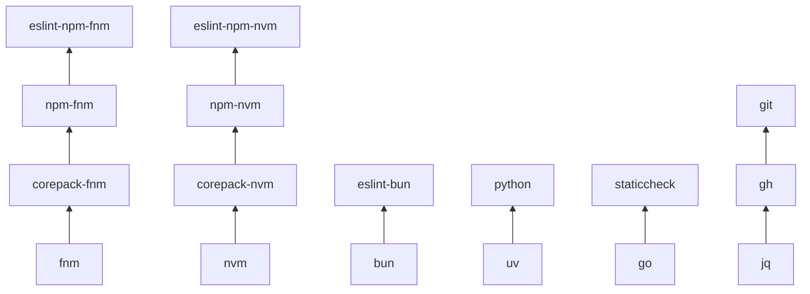

# TaskOtter

Reusable, tested [Taskfile](https://taskfile.dev) modules for installing and running common dev tools. Each module lives under `taskfiles/<name>/` with a `Taskfile.yml`, `README.md`, and Go tests.

## Quick start

### Standalone

```sh
task -t taskfiles/go/Taskfile.yml install
task -t taskfiles/go/Taskfile.yml lint
```

### Included in your Taskfile

```yaml
includes:
  go: ./taskfiles/go/Taskfile.yml
```

Then run:

```sh
task go:install
task go:lint
```

## Tools catalog

| Category | Modules | Count | Example |
| --- | --- | ---: | --- |
| Node runtimes | `fnm`, `nvm`, `bun` | 3 | [`fnm`](taskfiles/fnm/README.md) |
| Package managers | `npm-{fnm,nvm}`, `pnpm-{fnm,nvm}`, `yarn-{fnm,nvm}`, `corepack-{fnm,nvm}` | 8 | [`npm-fnm`](taskfiles/npm-fnm/README.md) |
| JS lint/format/check | `biome`, `bruno`, `depcheck`, `eslint`, `knip`, `prettier`, `stylelint`, `typescript` — each with 7 variants | 56 | [`eslint-npm-fnm`](taskfiles/eslint-npm-fnm/README.md) |
| Languages & runtimes | `go`, `python`, `uv`, `cargo`, `proto`, `staticcheck` | 6 | [`go`](taskfiles/go/README.md) |
| CI & infra | `actionlint`, `bash-exec`, `bencher`, `shellcheck`, `shfmt`, `yamllint`, `zizmor`, `hadolint`, `buf`, `docker`, `git`, `gh`, `jq`, `vault`, `ansible`, `sqlfluff`, `dotenv-linter`, `htmlhint-{npm,pnpm}-{fnm,nvm}`, `djlint`, `jsonlint`, `rumdl`, `protolint`, `spectral-{npm,pnpm}-{fnm,nvm}`, `adrs` | 30 | [`actionlint`](taskfiles/actionlint/README.md) |

**103 modules** total. Per-module docs: `taskfiles/<name>/README.md`.

Direct linter and formatter modules expose an empty-by-default
`<TOOL>_LINT_SKIP_PATTERN` and/or `<TOOL>_FMT_SKIP_PATTERN`. Patterns are
matched against forward-slash paths relative to the task working directory;
`*` stays within a path segment, `**` crosses directories, and `?` matches one
character. For example, `**/generated/**` skips generated files in any folder.

### Choosing a variant

For JavaScript tools, pick a module that matches your package manager and Node runtime:

```
{tool}-{pm}-{fnm|nvm}   →  eslint-npm-fnm, prettier-yarn-nvm, typescript-pnpm-fnm
{tool}-bun              →  eslint-bun, prettier-bun
```

Package-manager modules follow the same pattern: `npm-fnm`, `pnpm-nvm`, `yarn-fnm`, etc.

## Dependencies

Modules compose via Taskfile `includes:`. A JS tool variant typically depends on a package-manager module, which in turn depends on a Node runtime stack.



See [deps-tree.md](deps-tree.md) for the complete dependency graph (forward and reverse views).

Regenerate after editing [`.deps.yml`](.deps.yml):

```sh
python3 scripts/gen_deps_tree.py
```

## Development

Validate all modules:

```sh
go test ./...
```

Each module README must include a `## Public Tasks` table listing every public task from its `Taskfile.yml`. Tests enforce this contract — run `go test ./...` after changing Taskfiles or READMEs.
